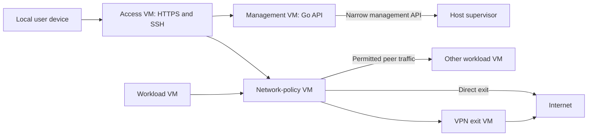

# VM platform on mini

Status: agreed architecture, implementation started. This document specifies
the intended behavior; it does not describe services already deployed. See
[the prototype status and runbook](../minivm/README.md) for implemented components,
validation results, and remaining work.

## Purpose

Build a personal VM platform, starting on `mini`.
Cloud Hypervisor runs NixOS guests created dynamically from versioned NixOS
templates. Guests can be repeatable managed systems or mutable development
machines in which agents prototype changes to those templates.

Network access is intentional and enforced outside the guest. Support VMs on
multiple physical hosts with consistent permissions, secure communication, and
authenticated access. Initial deployment is local-network only; off-site access
and additional hosts are deferred.

Design management around a controller API from the beginning. The CLI and a
future web UI are clients of the same API, with the same capabilities and
authorization. Building the web UI itself is not required for the first release.

## Existing host

The repository defines `nixosConfigurations.mini` as an x86_64-linux NixOS system.
Its configuration includes `kvm-intel`, systemd-networkd, SSH access, and an ext4
root filesystem inside LUKS. These are configuration observations, not runtime
verification of available hardware, capacity, or deployed state.

The existing filesystem and disk layout are not constraints. Reinstalling mini
and repartitioning its storage are acceptable parts of implementation. Use Btrfs
for VM backing storage.
The resulting installation must provide secure host administration access.

Reserve memory and free disk space for the host, controller, and builds when admitting VMs; do not allocate the entire machine to guests.

Decided implementation choices: Go controller and supervisor, Btrfs storage, Cloudflare DNS
for the configured domain, and automated Let's Encrypt certificates. Complete data loss is
acceptable: independent backups and disaster recovery are not initial requirements.
Persistence across normal guest/host restarts and correct operation retries still
matter. These decisions authorize design changes, not an immediate disk wipe.

## Components and trust



The controller and privileged supervisor are separate Go packages/binaries. Use
standard-library facilities for HTTP, JSON, process control, and the CLI. The
controller links to SQLite from pinned nixpkgs through a small C binding; the
supervisor uses only the Go standard library and is built with cgo disabled.
There are currently no third-party Go module dependencies. Adding dependencies
requires reviewing their transitive graph and any build-time execution.

Run infrastructure in dedicated managed NixOS VMs wherever practical. The host
retains Linux/KVM, Cloud Hypervisor processes, Btrfs administration, resource
accounting, isolated virtual links, and a small privileged supervisor.

| Component        | Location and authority                                                                     |
| ---------------- | ------------------------------------------------------------------------------------------ |
| Controller       | Management VM; Go API, durable records, authorization, and orchestration                   |
| Host supervisor  | Host; validated lifecycle/storage operations and structural network isolation              |
| Network policy   | Policy VM; per-source grants, DNS, IP/SNI inspection, and exit selection                   |
| VPN exits        | One VM per configured exit; only its own tunnel credentials and restricted underlay access |
| Human access     | Access VM; HTTPS/passkey sessions, SSH bastion, and authorized service forwarding          |
| Template builder | On-demand build VM; source checkout/builds and an explicit artifact import path            |
| Workloads        | Independent VMs; their own disks and explicitly granted network connections                |

The management VM calls a narrow host API over a dedicated authenticated channel.
It cannot submit arbitrary host commands, choose arbitrary host paths, or obtain a
host shell through that API. The supervisor validates identifiers, limits, disks,
and link attachments independently. Infrastructure topology and service roles
are operator-controlled; ordinary machine creation cannot request infrastructure
privileges. Build outputs are data imported through validation, not host code to
execute. Keep host Nix daemon and runtime sockets out of guests.

### Network wiring and authority

Use a separate point-to-point virtual segment per workload, connecting its TAP
interface only to a dedicated interface on the policy VM. A two-port host bridge
is an implementation option; never attach unrelated workloads to the same bridge.
The host prevents extra attachments or alternate paths. The policy VM binds
source addresses to ingress interfaces before applying grants. Guest-supplied
MAC/IP addresses are not proof of identity.

Separate management links, workload links, access-gateway links, and exit links.
Workloads cannot reach management interfaces or physical LAN interfaces directly.
The access VM reaches workloads through the policy VM with narrowly scoped
service/SSH grants. It does not have arbitrary host-administration access. Policy
updates arrive through a separate authenticated management interface.

Initially the host retains the physical NIC and provides restricted underlay
connectivity to infrastructure VMs. Host filtering constrains which infrastructure
interfaces may reach the LAN/internet and prevents workload bypass. Detailed
workload policy, DNS, TLS inspection, and VPN clients run in VMs. A dedicated NIC
passed through to a network VM is not required initially.

### Boot and failure behavior

The supervisor boots infrastructure from pinned, locally present artifacts and a
local bootstrap configuration. Startup must not require the controller, DNS,
a VPN, or a fresh build. Start policy/exit services and install their restrictions
before enabling workload traffic; the management and access VMs have independent
bootstrap paths. Retain a minimal operator-only host recovery path.

Persist policy state locally so a controller outage blocks changes without
removing installed restrictions. A stopped policy or VPN VM stops affected
traffic; it must not trigger a bypass. Start the builder on demand and reserve
part of mini's 32 GB RAM for infrastructure and host operation. Automatic
host-failure recovery is outside the initial scope.

Physical hosts remain trusted: their administrators can inspect guest memory and
storage. Infrastructure VMs are trusted only for their assigned role; compromise
of the policy VM can violate its traffic policy but must not provide access to
host disks or management APIs. Workload root cannot change platform grants.

Run each VMM with a separate service identity and restricted access to its own
files, sockets, and devices. Only the supervisor creates/attaches virtual links;
VMM processes have no general host network-administration authority. Enforce CPU,
memory, and storage limits independently of guest cooperation. Infrastructure
credentials are private to the service that needs them, not shared with workloads.

## Templates, identities, and guest modes

A template revision records its source revision, locked dependencies, build
artifacts, architecture, boot contract, and default resources and policy.
Building a template and creating an instance are separate operations. Creating
an instance from an available artifact must not require rebuilding the host.

Each instance has an immutable UUID, a unique name, stable private address,
machine ID, SSH host identity, selected template revision, guest mode, storage
references, and placement record. Names are unique within the platform and
restricted to safe DNS labels. Policies bind to UUIDs, not reusable names or IPs.
Deleting and recreating a name must not silently inherit the old VM's grants.

| Property          | Managed                                       | Development                                  |
| ----------------- | --------------------------------------------- | -------------------------------------------- |
| System            | Pinned template artifacts                     | Starts from a pinned template, can diverge   |
| Persistent writes | Declared data volumes                         | Full root filesystem and Nix store/database  |
| Updates           | New template revision and restart/replacement | Guest package installation and nixos-rebuild |
| Intended use      | Services and reproducible workloads           | Agent development and template prototyping   |

Managed guests use an immutable system and explicit writable state. Development
guests have their own persistent Nix store and database. Do not expose the entire
host store to guests as the default storage model. Template images must not
contain reusable machine IDs, SSH private keys, or user secrets.

The template specifies persistence mounts and initialization behavior. Changes
to persistence layout need an explicit data-upgrade procedure; switching a template pointer
does not roll back database or filesystem changes.

### Development and promotion

1. Create a development instance from a template revision with a source checkout.
2. Let the agent edit the template, install packages, and rebuild the guest.
3. Record source changes using jj and build a new template artifact.
4. Boot a fresh managed instance from that artifact and validate it.
5. Promote the artifact and explicitly update selected instances.

Promotion rebuilds from source, rather than publishing the development disk.
This catches dependencies on manual changes and prevents accidental inclusion
of development secrets. A debug clone of an existing instance is a separate
operation: it gets a new identity, no inherited publication or peer grants, and
explicit handling of copied application credentials and data.

### Boot contract

Development guests must be able to change their next-boot kernel and initrd using
normal NixOS rebuilds. A permanently host-selected direct-boot kernel would not
satisfy that requirement.

Evaluate guest-owned firmware boot first for development disks. If that proves
unsuitable, implement and document a host/guest boot-artifact handover. Validate
rebuild, reboot, and rollback before committing to a guest image framework.
Managed guests may use direct boot, with artifacts pinned by the controller.
Record all boot dependencies in the instance manifest.

`microvm.nix` is a candidate for building managed guest artifacts and runners,
not an assumed complete controller or a settled choice for mutable guests.

## Lifecycle and durable state

Expose create, inspect, start, stop, restart, update, and delete operations.
Commands below illustrate a proposed interface, not existing tools.
The CLI translates these commands into API requests; it must not directly modify
controller state or invoke host tools to perform management operations.

```sh
minivm create agent-dev --template agent --mode development
minivm create database --template postgres --mode managed
minivm allow agent-dev database --tcp 5432
minivm expose agent-dev --default-port 3000
minivm ssh agent-dev
```

Track desired state separately from observed state. Operations have durable IDs,
phases, errors, and retry semantics. A controller or agent restart reconciles
partial work instead of creating duplicate instances or losing ownership.

Creation reserves identity and capacity, prepares storage and boot metadata,
installs default-deny networking, then boots and checks readiness. Failed
creation retains a diagnosable operation record and cleans up unowned resources.

Stopping retains disks and identity. Deletion first stops the VM and withdraws
access, routes, and grants; deletion of retained data must be an explicit part
of the request. Track artifact references/GC roots so Nix garbage collection
cannot remove boot dependencies of stopped or running VMs.

Suggested layout:

```text
/var/lib/vm-state/controller/             authoritative database and operation log
/var/lib/vm-state/templates/<revision>/  artifact manifests and references
/var/lib/vm-state/instances/<uuid>/       instance metadata and writable disks
/run/minivm/<uuid>/                    private VMM/control sockets
```

Separate durable metadata from generated runtime configuration. Persist controller
records and guest volumes locally across restarts. Independent backups are out
of scope initially; disk failure may require rebuilding the platform from source
and creating new instances and credentials.

## Management API and future web UI

Use a versioned HTTP/JSON API under `/api/v1`, described by an OpenAPI contract
maintained alongside the implementation. Define resources and operation semantics
before implementing CLI commands. The browser UI must be able to create and
manage machines without shell access, parsing CLI output, or knowing host paths,
systemd unit names, or Cloud Hypervisor internals.

The controller API is distinct from both the private host-agent protocol and
Cloud Hypervisor's local API. Only the controller authorizes and orchestrates
management requests. Guest creation accepts template revision IDs and validated
options, not arbitrary host paths, shell commands, or executable Nix expressions.
Template source/build registration is a separate authorized capability.

### Resources and operations

| Resource                | Required capabilities                                                                              |
| ----------------------- | -------------------------------------------------------------------------------------------------- |
| Templates and revisions | List available revisions, defaults, schemas, build status, and supported guest modes               |
| Machines                | Create, list, inspect, update, start, stop, restart, and delete                                    |
| Network policy          | Read effective policy; manage egress settings and peer/host grants                                 |
| HTTPS publication       | Read available application-port range and set the default destination for 443                      |
| Storage                 | Inspect usage, retained volumes, checkpoints, and explicitly requested data deletion               |
| Egress exits            | List permitted direct/VPN choices, inspect health, and select an exit per machine                  |
| Hosts                   | List authorized placement choices and capacity; restrict enrollment and administration separately  |
| Operations              | Inspect progress, results, and structured failures of asynchronous work                            |
| Access                  | Inspect current identity and capabilities; manage authorized users/keys and grants where permitted |

Representative endpoints (proposed contract):

```text
GET    /api/v1/templates
GET    /api/v1/templates/{id}/revisions
POST   /api/v1/machines
GET    /api/v1/machines
GET    /api/v1/machines/{id}
PATCH  /api/v1/machines/{id}
POST   /api/v1/machines/{id}/actions/start
POST   /api/v1/machines/{id}/actions/stop
POST   /api/v1/machines/{id}/actions/restart
DELETE /api/v1/machines/{id}
GET    /api/v1/machines/{id}/network-policy
PUT    /api/v1/machines/{id}/network-policy
PUT    /api/v1/machines/{id}/https-publication
GET    /api/v1/operations/{id}
GET    /api/v1/events
```

Creation pins an explicit template revision; if a client chooses a default, the
controller resolves and records its immutable revision at acceptance. Return
server-side defaults, permitted resource ranges, and validation errors so clients
can build useful forms without duplicating policy. Responses distinguish desired
configuration from observed state and expose applied configuration revisions,
health, and authorized access URLs. Represent secrets as write-only fields;
do not return stored credentials through inspect or event responses.

### Asynchronous work and concurrency

Long-running mutations return `202 Accepted` with a durable operation ID and
status URL. Acceptance means the request is durably recorded, not that the VM is
ready. Operations expose queued/running/succeeded/failed states, meaningful
phases, timestamps, resource references, and structured error codes. Expose
cancellation only for operations/phases where it can be performed safely.

Support idempotency keys for create and action requests. Scope keys to the caller
and request, return the same operation on a matching retry, and reject reuse with
a different payload. Document the retention window. Serialize incompatible work
on a machine; reject conflicts instead of racing start, delete, and update.
Use resource revisions/ETags with conditional updates to prevent a CLI and web UI
from silently overwriting each other's changes. Define replacement versus patch
semantics explicitly, especially for grants and destructive storage options.

Provide paginated list endpoints and stable machine-readable errors with field
details and request IDs. Stream authorized status changes using server-sent
events, with event IDs and reconnect support; retain polling as a fallback.
On an expired event cursor, require a fresh resource read. Events notify clients
to reconcile state and do not replace authoritative resource endpoints. A browser
disconnect must not cancel a durable operation.

### Management authentication and authorization

Serve the API and future UI on a dedicated management origin, such as
`console.example.net`, reachable on the local network initially. Reserve that name from VM creation
and route it separately from guest application hosts. Human browser access uses
the passkey login and scoped secure sessions. Keep UI and API same-origin, apply
CSRF protection to cookie-authenticated mutations, and deny cross-origin API
access from guest applications.

The CLI also needs explicit API authentication: local-network access or a guest
SSH key alone does not confer management rights. Provide a browser-assisted
passkey login that issues a scoped, expiring, revocable CLI credential, stored
using the client's secure credential storage. Separately authorized automation
credentials may be added without embedding human sessions in scripts.

Check authorization on every resource/action, including lists and event streams.
Distinguish permission to create machines, access a guest, change network policy,
publish a default port, register/build templates, and administer hosts. Guest root
cannot alter these rights. Revocation must cover API credentials and streams as
well as gateway sessions. Audit mutations with actor, request/operation ID,
target, and outcome, excluding secrets. Apply request and operation limits so an
authorized client cannot accidentally exhaust controller or host capacity.

Keep privileged recovery procedures separate from the regular client interface.
Normal CLI and UI workflows always use the controller API.

## Network policy

Each workload has an isolated link to the policy VM as described above. Route
traffic there and bind source addresses to ingress interfaces before applying
grants. Allocate unique VM addresses across the platform.

Policy has three independent dimensions:

| Dimension | Behavior                                                   |
| --------- | ---------------------------------------------------------- |
| Internet  | None, all public destinations, or an allowlist             |
| VM peers  | Directional grants to a VM, protocol, and destination port |
| Host/LAN  | Blocked unless specifically granted                        |

An illustrative Nix-shaped schema:

```nix
{
  template = "agent";
  mode = "development";
  network = {
    internet = {
      mode = "allowlist"; # none, public, allowlist
      allow = [
        { type = "tls-hostname"; hostname = "api.anthropic.com"; tcp = [ 443 ]; }
        { type = "ip"; cidr = "203.0.113.10/32"; tcp = [ 443 ]; }
      ];
    };
    peers = [
      { vm = "database"; tcp = [ 5432 ]; }
    ];
  };
  access.https.defaultPort = 3000;
}
```

The IP above is a documentation example. Resolve VM names to immutable IDs when
accepting policy. Template policies provide defaults; authorized instance
overrides determine the effective policy, subject to platform restrictions.
Show that effective policy through inspect, including why a connection is denied.

"Public" excludes other VMs, host addresses, local networks, management networks,
link-local/metadata endpoints, and other special-use destinations. Include
locally routed public prefixes in protected infrastructure where necessary.
IPv6 must receive equivalent enforcement or be blocked entirely until supported.

Install restrictions before enabling interfaces. Apply updates atomically where
possible, preserve deny rules through reloads, and coordinate forwarding/NAT
rules in the policy VM with structural restrictions in the host firewall. Grants permit replies, not new connections
in the reverse direction. Revocation must invalidate relevant existing
connections, including proxy sessions, rather than only blocking new ones.

### Hostname rules and egress

Hostname allowlist rules require both a destination IP resolved by the platform
for that hostname and a matching visible TLS Server Name Indication (SNI). IP/CIDR
rules remain a separate, explicit way to authorize general TCP/UDP traffic; they
do not imply SNI validation. The public-egress mode does not impose hostname rules.

For a hostname rule, force TCP connections through the policy VM's TLS inspection
gateway with no direct bypass. Identify the VM from its ingress interface, inspect
the initial ClientHello, normalize and compare its SNI to the authorized hostname,
and require the original destination IP to belong to that same hostname's current
platform-resolved address set. Do not combine the union of allowed IPs with the
union of allowed names: an IP/SNI pair must match a single rule and permitted port.
Buffer the handshake with bounded size/time limits and handle fragmented records
and TCP segmentation. Reject malformed, missing, or mismatched SNI before relaying.

The platform owns DNS resolution and expiry. Validate actual A/AAAA destinations
against protected ranges, including through CNAMEs. DNS aliases do not automatically
become allowed SNI names. Track TTLs, fail closed on expired/unavailable resolution
for new connections, and define how cached addresses and established connections
are retired. Explicit policy revocation closes affected active connections.

For hostname rules initially, reject plaintext, STARTTLS, and encrypted ClientHello
(ECH), including its extension when used as GREASE: an outer cover name cannot be
accepted as proof of the hidden hostname. Block UDP/QUIC paths under these rules;
clients need ordinary TLS over TCP. Do not fall back to IP-only authorization when
inspection is impossible. These restrictions may require client configuration.

This is connection-level DNS-plus-SNI filtering, not HTTP request validation or
upstream authentication by the gateway. TLS stays end-to-end, and clients remain
responsible for certificate verification. A malicious guest can send allowed SNI
but a different encrypted HTTP Host/:authority, and HTTP/2 connection coalescing
can carry multiple origins on one connection. The gateway cannot detect those
cases or inspect redirects inside TLS. New connections must pass the same checks.
This limitation is part of the chosen model; TLS interception is not planned.

Define DNS alongside egress: a VM with no internet access must not retain
unrestricted external DNS. Provide controlled internal resolution, with public
resolution constrained as appropriate. Allowed external services can themselves
relay data; the policy authorizes those services, not every possible use of them.

### Optional VPN exits

Internet permissions and routing are separate settings. A VM selects `direct` or
an authorized named VPN exit through the controller API; the future UI presents
the same choices. `none` internet policy still denies access regardless of exit.
An illustrative instance setting is `network.internet.route = "vpn-personal"`.
VPN exits may connect to a provider or an operator-controlled WireGuard endpoint.
No VPN provider or endpoint has been selected yet.

Route allowed internet traffic from the policy VM into the selected VPN VM.
That VM has an internal link and a restricted underlay link for tunnel transport;
the host permits underlay traffic only to configured VPN endpoints and explicitly
required bootstrap services. The VPN VM forwards internal traffic only through
its tunnel, with no direct fallback. Workloads never attach to its underlay.

The policy VM's upstream TLS-proxy connections and public DNS queries must use
the same selected exit as the workload. Keep DNS caches and connection state
separate by exit and preserve source policy attribution through proxying/NAT.
VM-to-VM grants and replies to human access connections use internal routes,
not the internet VPN. Apply equivalent IPv6 routing or block it.

When a tunnel fails or restarts, affected connections fail closed. Changing exits
closes existing internet connections rather than silently retaining the old exit.
Expose exit availability and routing failures through the API. Workload users
cannot retrieve tunnel credentials or change their route without authorization.
Outbound VPN support is independent of the deferred remote-access setup.

## Human access

Initially devices reach the access gateways on the local network. Do not expose
VM addresses or bypass paths to LAN clients. Gateway and host firewalls enforce
that human access enters through authenticated HTTPS or SSH. Local-network
membership is not authentication. Off-site connectivity, router forwarding,
WireGuard device enrollment, and relay setup are deferred. The gateways can later
be made reachable over WireGuard without changing the application authentication
model.

Human access permissions are separate from workload network grants. A user may
access a VM without authorizing it to contact another VM. Guest policy cannot
grant human access or change gateway publication settings.

### HTTPS on the configured domain

Cloudflare hosts DNS for the configured domain. Resolve `*.example.net` to the local gateway
address using DNS-only records or local DNS; do not route application traffic
through Cloudflare's HTTP proxy. TLS terminates at the gateway. Automate Let's
Encrypt wildcard issuance and renewal using ACME DNS-01 and a Cloudflare API
token restricted to the required zone/DNS permissions. No public inbound access
is needed for DNS-01; the ACME service in the access VM needs explicit outbound
ACME and Cloudflare API access. Store its token outside the Nix store, private
to that service, and never in workload filesystems. Verify automated
renewal and certificate reload, using ACME staging during setup.

| External URL                       | VM destination                               |
| ---------------------------------- | -------------------------------------------- |
| https://agent-dev.example.net:3000 | HTTP on port 3000                            |
| https://agent-dev.example.net:8080 | HTTP on port 8080                            |
| https://agent-dev.example.net      | Externally selected default application port |

Every port in a configured application range is automatically addressable for
an authorized user. Exclude browser-blocked ports and reserve gateway ports.
Select the exact range during implementation. This is HTTP/WebSocket proxying,
not arbitrary TCP exposure. Support explicit HTTPS upstream configuration when
an application requires it. Guest applications must listen on their VM interface,
not only localhost, unless a separate guest forwarding mechanism is added.

The controller owns the default destination for external 443. Changing it needs
no guest rebuild/restart. Publication is still authenticated; it is not public
anonymous sharing.

Use a central passkey/WebAuthn login and expiring authenticated sessions. Every
application port checks authentication and VM authorization before forwarding,
including WebSocket upgrades. Use a fixed login callback origin, validate return
URLs, and prevent callback tickets from becoming reusable bearer credentials.
Define enrollment, additional passkeys, recovery, logout, and session revocation
before exposing the service.

Keep the authentication service on a separate origin. Cookies are shared across
ports: applications in one VM therefore share a hostname trust boundary. Avoid
parent-domain cookies, strip gateway credentials before upstream forwarding,
prevent upstream responses from overwriting reserved authentication cookies,
and strip untrusted identity headers before adding gateway-controlled identity.
Validate hostname/SNI/HTTP authority consistently and reject unknown or ambiguous
targets; a supplied Host header must not turn the gateway into an open proxy.
Validate WebSocket origins and protect controller mutations against CSRF.

Access to arbitrary non-default ports may be restricted by client networks; the
selected application remains available on standard 443.

### SSH

Use a bastion with ProxyJump initially. Authenticate the user with an SSH key at
both the bastion and guest, without agent forwarding. The bastion has no general
shell and permits only authorized destination VM addresses on port 22. Disable
unneeded forwarding modes, especially remote forwarding, and update permitted
destinations when grants change.

Clients verify guest host identities. An SSH host CA can associate those
identities with stable VM names. Cloning creates a new identity. Guest user access
can initially use authorized keys; certificate-based user access is an
implementation option.

SSH shell access allows running clients and tunnels inside the guest. Workload
policy still constrains their reach. The boundary is authenticated HTTPS/SSH
entry plus infrastructure-enforced guest networking, not a promise to prevent tunneling
by an authorized shell user.

## Multiple hosts (deferred)

The following describes a future extension, not a prerequisite for the initial
local deployment.

Enroll each host explicitly with distinct WireGuard keys and management
credentials. Authenticate controller/agent communication and authorize host
operations; do not make management APIs accessible to guests or ordinary device
peers. Support credential rotation and host removal.

Use host-to-host WireGuard for encrypted routed VM traffic. Distribute per-VM
routes and peer source-address permissions for the VMs assigned to each host.
Enforce grants in each host's policy VM, with the host enforcing link isolation.
WireGuard supplies transport authentication;
it does not replace protocol/port authorization.

Address allocation must avoid site-network collisions. Test MTU/path discovery
and cross-site routing. Hosts behind NAT need a reachable peer or relay design;
basic WireGuard configuration alone does not solve discovery or relay selection.

Gateway routing resolves VM identity to the assigned host. Apply the same human
access controls and workload grants whether VMs share a host or communicate
across hosts.

## Storage

Use Btrfs backing storage with raw guest disk images in per-instance subvolumes.
Guests may use ext4 internally. Use read-only template snapshots and writable
clones for new instances. Keep copy-on-write enabled so the design can use shared
extents and snapshots; validate behavior under representative guest writes.

Use the existing 1 TB capacity as the initial budget; a 2 TB replacement can add
headroom without changing the design. Select the Btrfs quota/accounting mode in
the prototype, including how shared template data and snapshots count toward
limits. Measure actual host consumption, bound guest disk sizes, retain free
space for the host, and test handling of disk pressure. Single-disk storage has
no redundancy, which is acceptable for this deployment.

Snapshots and writable clones should support checkpoints before agent experiments
and new development instances. Clones receive fresh platform identities as
specified above. A disk snapshot does not capture running processes or guest
memory. A snapshot taken while a VM runs is only crash-consistent unless guest
applications and filesystems are coordinated; use clean shutdown or guest
quiescing when application consistency is required.

Checkpoints are for development convenience, not disaster recovery. Test local
checkpoint restore and normal reboot persistence. Independent backups, backup
retention policies, and guarantees against total data loss are out of scope.

## Implementation milestones and acceptance criteria

1. **Guest artifacts and boot:** validate managed and mutable boot contracts on
   Cloud Hypervisor. Create two guests from one revision with unique identities.
   Verify development nixos-rebuild, reboot, and persistence of the Nix database.
2. **Single-host lifecycle and infrastructure:** implement durable operations, resource controls,
   restart reconciliation, retained disks, and safe artifact retention. Validate
   recovery from interruptions during create/start/stop. Verify storage cloning,
   capacity limits, local checkpoint restore, and persistence across host reboot.
   Implement the API contract and make the CLI its first client. Verify retries
   after lost responses, conflicting updates, structured validation, and operation
   status/events without relying on a browser UI. Verify infrastructure boot with
   the controller initially unavailable, recovery access, narrow supervisor API
   validation, and inability of workloads to attach to privileged links.
3. **Networking:** demonstrate default isolation, a directional port grant,
   anti-spoofing, policy revocation during an existing connection, and equivalent
   IPv6 treatment. Verify each egress mode, DNS behavior, protected destinations,
   and proxy-bypass attempts from a root guest. Test matching and mismatched
   IP/SNI pairs, missing SNI, ECH, QUIC bypass, expired DNS, and fragmented TLS.
   Stop the policy VM and verify traffic cannot bypass it. For optional VPN exits,
   verify DNS/proxy routing and no plaintext fallback during tunnel failure.
4. **Human access:** implement local-network gateway reachability, passkey sessions,
   per-port HTTPS/WebSockets, selectable 443 target, and SSH authorization. Test
   direct-IP bypass, forged identities, hostile cookies, unknown hostnames,
   session revocation, and unauthorized SSH forwarding. Verify Cloudflare DNS-01
   certificate issuance, automated renewal, and reload without public ingress.
   Verify management API authorization, passkey-based CLI login, CSRF protection,
   and isolation from guest origins, including filtered lists and event streams.
5. **Deferred — two hosts:** create VMs on each host and verify encrypted cross-host traffic,
   directional grants, source-address enforcement, and gateway access. Test host
   enrollment/removal and denial of access to management services from guests.

## Decisions still needed before implementation

- Btrfs subvolume/quota layout, encryption, and reinstall plan.
- Guest image builder and mutable boot mechanism, after the boot prototype.
- Go API framework and private host-agent protocol.
- HTTPS proxy, passkey service, session design, and ACME client integration.
- Application port range and TLS inspection gateway implementation.
- Initial resource defaults, local address ranges, and disk limits.

These do not reopen the agreed behaviors; they select mechanisms to deliver them.

## Reference material

- [Cloud Hypervisor API](https://github.com/cloud-hypervisor/cloud-hypervisor/blob/main/docs/api.md)
  describes the VMM lifecycle API over local sockets.
- [microvm.nix](https://microvm-nix.github.io/microvm.nix/) and
  [imperative management](https://microvm-nix.github.io/microvm.nix/microvm-command.html)
  are candidates for guest construction and runner integration.
- [WireGuard routing model](https://www.wireguard.com/#cryptokey-routing)
  explains peer keys and permitted source/destination addresses.
- [Cilium layer-three policy](https://docs.cilium.io/en/stable/security/policy/layer3/)
  documents DNS-to-IP policy semantics; this is background, not a decision to deploy Cilium.
- [Envoy dynamic forward proxy](https://www.envoyproxy.io/docs/envoy/latest/configuration/http/http_filters/dynamic_forward_proxy_filter)
  discusses destination resolution and proxy security concerns.

- [Let's Encrypt challenge types](https://letsencrypt.org/docs/challenge-types/)
  describes DNS-01 wildcard validation without public gateway ingress.
- [TLS Inspector](https://www.envoyproxy.io/docs/envoy/latest/configuration/listeners/listener_filters/tls_inspector.html)
  illustrates ClientHello/SNI inspection without TLS termination.
- [RFC 9849: Encrypted Client Hello](https://www.rfc-editor.org/rfc/rfc9849.html)
  explains why an outer SNI cannot establish the encrypted inner server name.
